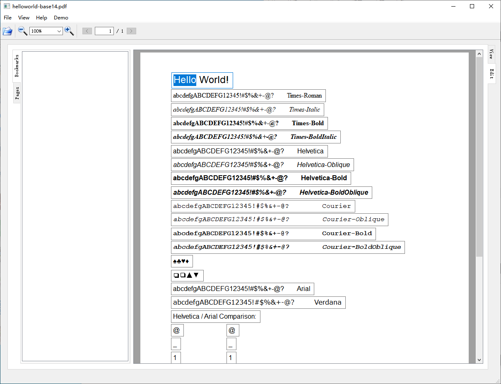

# UntitledPDF

UntitledPDF 是一个神秘而充满未知 ~~（有待开发）~~ 的 PDF 编辑器，今天也在为了做好 PDF 编辑而努力。

### 环境依赖

* Qt 5.15.2 + WebEngine 模块（包含 PDF 模块）[Download Qt](https://download.qt.io/official_releases/online_installers/)

* PoDoFo 0.11.0（master 分支）[Download PoDoFo](https://github.com/podofo/podofo)

Qt PDF 模块用于 PDF 阅读，在安装 Qt 5.15.2 时需勾选 WebEngine 模块。

PoDoFo 用于 PDF 解析，需要自己编译源码（参考 [podofo/README.md](https://github.com/podofo/podofo/blob/master/README.md)），将编译得到的 `podofo.lib` 复制到 `3rdparty/PoDoFo/lib` 目录下，将 `podofo.dll` 等动态链接库所在的目录（如 `D:/PoDoFo/build/target/Debug` ）添加到 `PATH` 环境变量。

### 功能清单

* PDF 查看，支持书签
* 单页 PDF 文本内容的编辑与保存

### Demo

* 编辑 PDF

